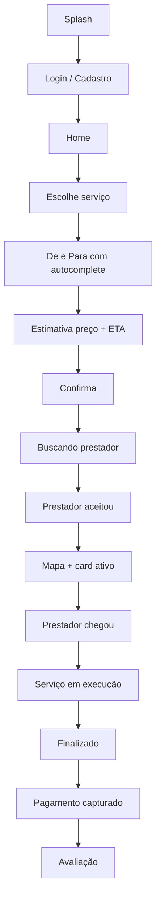

# Plano de desenvolvimento — MobiliAuto MVP

Versão 1.0 · agosto de 2026  
Complementa o [plano de negócio](./plano-de-negocio.md).

---

## 1. Objetivo técnico

Entregar um MVP utilizável em **uma praça**, cobrindo o ciclo completo:

**cliente pede → prestador aceita → desloca → executa → cliente paga e avalia**

com um **painel admin** capaz de despachar manualmente quando o match automático não achar prestador.

Não é objetivo do MVP: assinatura, cashback, calendário veicular, modo segurança completo, jurídico pós-blitz, ads, iOS TestFlight em escala nacional.

---

## 2. Escopo do MVP

### 2.1 Entra na v1

| Área | Escopo |
| ---- | ------ |
| Apps | Cliente (iOS/Android) e Prestador (iOS/Android), mesmo codebase com papéis |
| Auth | Splash, login, cadastro, recuperar senha |
| Perfil cliente | Dados pessoais, endereço (casa/trabalho), CNH, veículos, pagamento (cadastro do método) |
| Home cliente | Slider (1 imagem por vez), atalhos dos 3 serviços, card de chamado ativo, tabs |
| Pedido | Tela De / Para com autocomplete; origem por GPS; destino opcional conforme o serviço |
| Match | Push ao prestador próximo; aceite em 30s; fallback para fila / admin |
| Mapa | Rastreio em tempo real; bottom sheet de status |
| Chat / ligar | Chat in-app **ou** deep link de ligação (MVP pode começar só com ligação mascarada/direta) |
| Pagamento | Pix e cartão via Mercado Pago; captura após conclusão |
| Avaliação | 1–5 estrelas + comentário opcional |
| Admin web | Credenciar prestador, criar chamado manual, ver mapa/lista, ajustar status e preços |
| Serviços | **Guincho, chaveiro, mecânico** |

### 2.2 Fica para v1.1 / v2

- Borracheiro e motorista (resgate / substituto)
- Pane seca como serviço próprio
- Planos de assinatura e cashback
- Upload + validade bloqueando serviço (CNH/CRLV) de forma rígida
- Calendário veicular, histórico de manutenção
- Login social (Google/Apple)
- Chat completo com mídia
- Integração Waze/Google Maps nativa no prestador (atalho sim; navegação embarcada não)
- Relatórios avançados, export Excel

### 2.3 Fora de produto

- Remoção hospitalar
- Hospedagem
- Classificados de compra e venda de veículos

---

## 3. Papéis e permissões

| `role` | App | Pode |
| ------ | --- | ---- |
| `user` | Cliente | Pedir serviço, pagar, avaliar, gerenciar perfil/veículos |
| `provider` | Prestador | Ficar online, aceitar/recusar, atualizar status do atendimento |
| `admin` | Web | Tudo operacional: usuários, prestadores, chamados, preços, logs |

Um prestador é um `user` com perfil `Provider` (CNPJ opcional, veículo de atendimento, tipos de serviço habilitados, status operacional).

---

## 4. Jornadas

### 4.1 Cliente — pedido feliz



### 4.2 Prestador — turno

1. Login → liga status **Disponível**.
2. Recebe chamado (push + som) → 30s para aceitar/recusar.
3. Navega até o cliente (atalho Maps/Waze).
4. Status: `accepted` → `en_route` → `arrived` → `in_progress` → `completed`.
5. Encerramento gera cobrança e libera avaliação.

### 4.3 Admin — despacho assistido

Usado quando o cliente ligou/WhatsApp ou o match expirou.

Campos da tela “Nova solicitação”:

- Cliente: nome, telefone, e-mail (opcional), localização, tipo, descrição, foto, destino, veículo
- Prestador: empresa, motorista, placa, tipo de viatura, telefone, origem, ETA
- Operação: canal, operador, pagamento, valor

Flag de produto: `isStartLocationEnabled` (boolean) — habilita ou esconde o input **De** (quando a origem é só GPS).

---

## 5. Mapa de telas (cliente)

Navegação inferior: **Início · Serviços · Histórico · Perfil**.

### Autenticação

| Tela | Conteúdo |
| ---- | -------- |
| Splash | Fundo `#FF5722`, logo branco, slogan, ~2s |
| Login | Email, senha, lembrar-me, Entrar, esqueci senha, criar conta |
| Cadastro | Nome, email, CPF, telefone (máscara), senha, confirmar senha (mín. 6 + 1 número) |
| Recuperar | Email → código 6 dígitos → nova senha |

### Perfil (menu)

- Dados pessoais (foto, nome, email, CPF, celular) — ver e editar
- Endereço (casa e trabalho, criar/visualizar)
- CNH
- Veículos
- Serviços (histórico / preferências)
- Pagamento

### Home

- Slider: **uma imagem por vez**
- Botões de serviço menores (não competir com o slider)
- Se houver chamado: **card ativo** (serviço, local, ETA, motorista, placa, telefone, status, Rastrear / Detalhes / Cancelar)
- Sem chamado: CTA “Solicitar socorro”

### Endereço do pedido

- Título sugerido: “Para onde você vai?” / tela limpa só com inputs
- `De:` e `Para onde?:` com ícone de pin
- Ao digitar ≥ 2 caracteres: lista de sugestões (Places)
- **Sem botão Buscar** — o tap na sugestão preenche e segue
- GPS preenche origem

### Pedido de guincho (campos extras)

- Descrição do problema (opcional)
- Foto (opcional)
- Tipo de veículo: carro / moto / utilitário
- Tipo de guincho: plataforma / reboque / moto socorro
- Urgência: imediato (agendar fica fora do MVP)
- Pagamento: Pix / cartão

### Prestador — mapa

- Topo: foto, nome, status Disponível / Ocupado / Offline, toggle
- Mapa ~80% com marcadores (eu, origem, destino) e rota laranja
- Bottom sheet: cliente, endereços, ETA, Aceitar/Recusar, Iniciar, Finalizar
- FAB centralizar; atalho chat/ligar; atalho navegação externa

---

## 6. Arquitetura

```
[App Cliente RN] ──HTTPS/WS──┐
[App Prestador RN] ──HTTPS/WS─┼── [API Node.js] ── MongoDB
[Admin Next.js] ──HTTPS───────┘         │
                                        ├── Mercado Pago
                                        ├── Google Maps / Places / Distance Matrix
                                        ├── Firebase Cloud Messaging
                                        ├── S3 ou Cloudinary
                                        └── Sentry
```

### 6.1 Stack recomendada (alinhada às decisões de 2025)

| Camada | Tecnologia |
| ------ | ---------- |
| Mobile | React Native + **Expo** + TypeScript |
| Estado | Redux Toolkit **ou** TanStack Query + Context (preferir Query para server state) |
| Navegação | React Navigation |
| Local | SecureStore (token), AsyncStorage (prefs) |
| API | Node.js + Express (ou NestJS se o sócio preferir estrutura; Express atende o MVP) |
| Tempo real | Socket.IO (posição do prestador + status do chamado) |
| Banco | MongoDB Atlas |
| Auth | JWT + bcrypt, refresh token |
| Admin | Next.js + Tailwind |
| Push | FCM |
| CI | GitHub Actions + EAS Build |

**Nota sobre este repositório:** `ApiAdonisExample` é um backend Adonis 4 de academia (HiperFit). **Não reutilizar como base do MobiliAuto.** O MVP deve nascer em repositório(s) novos (`mobiliauto-api`, `mobiliauto-app`, `mobiliauto-admin`).

### 6.2 Tempo real

- Prestador envia `location` a cada 3–5s quando `en_route` / `in_progress` (com threshold de metros para economizar bateria).
- Cliente assina a sala `request:{id}`.
- Admin pode assinar o mesmo canal para o mapa da central.

### 6.3 Segurança

- HTTPS only
- Senha com bcrypt
- Rate limit em `/auth/login`
- Validação de upload (tipo, tamanho)
- LGPD: endpoint de exclusão de conta
- Logs de ações relevantes (pedido, pagamento, cancelamento)
- Tokens no SecureStore, nunca em AsyncStorage de senha

---

## 7. Modelo de dados (mínimo)

Coleções Mongo (nomes em inglês; campos de negócio em camelCase).

```
User
  _id, name, email, passwordHash, cpf, phone, role
  avatarUrl, emailVerifiedAt, createdAt

Address
  _id, userId, label ("home"|"work"|"other"), street, number
  complement, neighborhood, city, state, zip
  location { type: "Point", coordinates: [lng, lat] }

Vehicle
  _id, userId, plate, brand, model, year, type, color, crlvUrl

Document
  _id, userId, kind ("cnh"|"crlv"), files[], expiresAt

Provider
  _id, userId, companyName, cnpj
  services[]          // "tow" | "locksmith" | "mechanic" | "tire" | "driver"
  vehicle { plate, kind, photoUrl }
  status              // "offline" | "available" | "busy"
  location Point
  ratingAvg, ratingCount
  documentsVerified

Request
  _id, code, channel  // "app" | "whatsapp" | "phone"
  userId, providerId, operatorId
  service             // "tow" | "locksmith" | "mechanic"
  vehicleType, towType
  origin { address, location }
  destination { address, location }   // opcional
  isStartLocationEnabled
  description, photoUrl
  status              // ver máquina de estados
  priceEstimated, priceFinal, currency
  etaSeconds
  timeline[]          // { status, at, by }
  createdAt

Payment
  _id, requestId, provider "mercadopago"
  method, status, amount, externalId, capturedAt

Review
  _id, requestId, fromUserId, toUserId, stars, comment

SavedPlace  // atalho casa/trabalho
  _id, userId, kind, addressId
```

Índices geoespaciais em `Provider.location` e `Request.origin.location`.

### Máquina de estados do chamado

`pending` → `searching` → `accepted` → `en_route` → `arrived` → `in_progress` → `completed`  
Ramificações: `canceled_by_user` | `canceled_by_provider` | `expired` | `admin_assigned`

Prestador tem 30s em `searching` para aceitar; senão o sistema oferece ao próximo (até N tentativas) e cai no **painel admin**.

---

## 8. Contratos de API (MVP)

Base: `https://api.mobiliauto.com.br/v1` (dev: Railway/Render).

### Auth

`POST /auth/register`  
`POST /auth/login`

Request login:

```json
{ "email": "usuario@email.com", "password": "senhaSegura123" }
```

Response 200:

```json
{
  "user": {
    "id": "uuid",
    "name": "João Silva",
    "email": "usuario@email.com",
    "role": "user",
    "phone": "+55 41 99999-1234",
    "avatarUrl": null,
    "createdAt": "2026-08-24T00:00:00.000Z"
  },
  "token": "jwt...",
  "expiresIn": 3600
}
```

Erros: `401` credenciais; `422` validação.

Também: `POST /auth/forgot`, `POST /auth/reset`, `POST /auth/refresh`, `DELETE /users/me` (LGPD).

### Pedidos

`POST /requests` — cria chamado  
`GET /requests/:id`  
`GET /requests` — histórico do papel logado  
`POST /requests/:id/cancel`  
`POST /requests/:id/accept` (prestador)  
`POST /requests/:id/status` body `{ "status": "en_route" }`  
`GET /requests/:id/estimate` — preço + ETA antes de confirmar

Payload típico de criação (guincho):

```json
{
  "service": "tow",
  "location": { "lat": -25.4372, "lng": -49.2733, "address": "Av. Brasil, 1234" },
  "destination": "Rua XV de Novembro, 200",
  "problemDescription": "Carro parou após barulho no motor",
  "vehicleType": "car",
  "towType": "platform",
  "urgency": "immediate",
  "paymentMethod": "pix",
  "photoUrl": null
}
```

Admin: `POST /admin/requests` com bloco `user` + `provider` (despacho assistido).

### Outros

- `GET /places/autocomplete?q=`
- `GET /users/me` `PATCH /users/me`
- `CRUD /vehicles` `/addresses` `/documents`
- `POST /payments/requests/:id/intent`
- `POST /webhooks/mercadopago`
- `POST /reviews`

---

## 9. Regras de negócio (para o MVP)

Herdadas e filtradas das RNs originais. Numeração estável.

| ID | Regra |
| -- | ----- |
| RN001 | Cadastro com nome, email, telefone e senha forte. |
| RN002 | Email verificado **antes** de serviços pagos (MVP: pode suavizar para SMS/OTP no telefone). |
| RN003 | Um perfil por CPF. |
| RN004 | Papéis: `user`, `provider`, `admin`. |
| RN005 | Cliente pode cadastrar um ou mais veículos (placa, marca, modelo, ano). |
| RN006 | Pedido com GPS ou endereço manual. |
| RN007 | Exibir ETA **antes** de confirmar. |
| RN008 | Só prestador ativo e verificado recebe chamado. |
| RN009 | Aceite/recusa em até 30 segundos. |
| RN010 | Após aceite, rastreio em tempo real. |
| RN014 | Preço = taxa base + km (configurável no admin). |
| RN015 | Guincho leve/plataforma vs. outros tipos. |
| RN016 | Match prioriza proximidade e rating. |
| RN017 | Valor visível antes da confirmação. |
| RN018 | Pagamento: cartão e Pix no MVP; dinheiro só se flag de praça. |
| RN019 | Captura após conclusão (pré-autorizar no cartão). |
| RN033–035 | Avaliação 1–5; prestador com média &lt; 3,5 em 10 seguidas → suspensão. |
| RN036–039 | Admin credencia, desativa, ajusta preço/km. |
| RN041–043 | Logs, criptografia em trânsito, exclusão LGPD. |

**Não implementar no MVP:** RN011 (janela 06h–02h — o produto é 24h), RN020–025 (planos e calendário), RN028 (bloquear por documento vencido — avisar, não bloquear), RN029–032 (modo recuperar veículo / emergência completa — o motorista de resgate entra na v1.1).

Config: `isStartLocationEnabled` controla se o campo **De** aparece ou se a origem é só GPS.

---

## 10. Integrações

| Serviço | Uso no MVP | Observação |
| ------- | ---------- | ---------- |
| Google Places + Geocoding | Autocomplete De/Para | Debounce 300ms; cache curto |
| Distance Matrix / Directions | Preço e rota | Chamar só no estimate/confirm |
| Mercado Pago | Pix e cartão | Webhook obrigatório |
| FCM | Chamado, status, chat | Canais cliente vs. prestador |
| S3 / Cloudinary | Foto do chamado, avatar, CNH | |
| Sentry | Erros API e app | |
| Expo EAS | Build store | |

OpenStreetMap/Nominatim só como fallback se o custo do Google estourar — a UX de Places é o padrão.

---

## 11. Roadmap técnico (sprints de ~1–2 semanas)

Pressupõe 1 sócio dev full-time. Ajustar se for meio período.

| Sprint | Entrega | Critério de pronto |
| ------ | ------- | ------------------ |
| **0** | Repos, CI, ambientes, design tokens (Inter + paleta) | App abre splash com marca |
| **1** | Auth + perfil básico (dados pessoais) | Login/cadastro/recuperar; JWT no SecureStore |
| **2** | Veículos, endereços casa/trabalho, Places autocomplete | Tela De/Para funcional |
| **3** | Criar chamado guincho + estimate + máquina de estados | Pedido grava e aparece no admin |
| **4** | App prestador: online, lista/push, aceite 30s, mapa | Dois aparelhos completam um chamado de ponta a ponta **sem pagamento** |
| **5** | Tempo real (Socket.IO) + card ativo no cliente | Posição do prestador atualiza no mapa |
| **6** | Chaveiro e mecânico no mesmo fluxo (campos específicos) | Home com 3 serviços |
| **7** | Mercado Pago + comprovante + avaliação | Dinheiro real em sandbox |
| **8** | Admin: despacho manual, preços, credenciamento | Operador cria chamado para cliente que ligou |
| **9** | Hardening: LGPD, rate limit, logs, Sentry, store listing | Beta fechado na praça |

**v1.1:** borracheiro, motorista resgate/substituto, chat, documentos CNH rígidos.  
**v2:** planos, calendário veicular, B2B.

### Definição de pronto do MVP (lançamento beta)

- [ ] Cliente pede guincho, chaveiro ou mecânico em produção
- [ ] Pelo menos 5 prestadores credenciados na praça piloto
- [ ] Admin consegue despachar se ninguém aceitar
- [ ] Pix funciona ponta a ponta
- [ ] Cancelamento e avaliação funcionam
- [ ] Política de privacidade e termos publicados
- [ ] Plantão operacional definido (mesmo que seja WhatsApp do fundador)

---

## 12. Qualidade e métricas de produto

### Engenharia

- Jest na API (auth, preço, state machine)
- Detox ou Maestro só depois do beta (não bloquear MVP)
- ESLint + TypeScript strict no app
- Feature flags por serviço e por cidade (`city.services = ["tow","locksmith","mechanic"]`)

### Métricas (Firebase Analytics + eventos na API)

| Evento | Para que serve |
| ------ | -------------- |
| `request_created` por serviço | mix de demanda |
| `request_accepted_seconds` | liquidez |
| `request_expired` | buraco de oferta |
| `eta_error` (previsto vs. real) | confiança |
| `cancel_reason` | fricção |
| `payment_failed` | receita |
| `review_stars` | qualidade da rede |
| Funil splash → pedido confirmado | UX |

---

## 13. Estrutura de repositórios sugerida

```
mobiliauto-app/      # Expo (cliente + prestador via role)
mobiliauto-api/      # Node API
mobiliauto-admin/    # Next.js
```

Monorepo (pnpm workspaces) é aceitável se o sócio preferir um único PR; o importante é **não** acoplar ao HiperFit/Adonis 4.

Pastas no app:

```
src/
  modules/
    auth/
    profile/
    request/
    map/
    payment/
    provider/
  shared/ui/         # botões, inputs, cards — UI kit da identidade
  lib/api.ts
  lib/socket.ts
```

---

## 14. Estimativa de esforço

| Bloco | Esforço relativo |
| ----- | ---------------- |
| Auth + perfil + veículos | Médio |
| Places + mapa + socket | Alto (é o risco técnico #1) |
| Match + state machine + fallback admin | Alto (é o risco de negócio #1) |
| Pagamento | Médio |
| Três tipos de serviço no mesmo pipeline | Baixo depois do guincho |
| Admin despacho | Médio |
| Lojas + push em produção | Médio (contas, certificados, FCM) |

Ordem de risco: **liquidez de prestador > GPS em background no Android > custo Maps > pagamento Pix**.

---

## 15. Próxima ação de engenharia

1. Criar os três repositórios (ou monorepo) **fora** deste backend HiperFit.
2. Fechar a praça piloto e a tabela de preços com 5 prestadores.
3. Sprint 0: tokens visuais + splash/login.
4. Implementar primeiro o **caminho guincho feliz** em homologação; só então ramificar chaveiro e mecânico.
